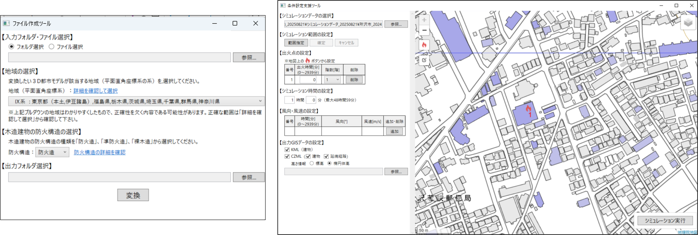

# 火災延焼シミュレーションシステム（ファイル作成ツール/条件設定支援ツール） <!-- OSSの対象物の名称を記載ください。分かりやすさを重視し、できるだけ日本語で命名ください。英語名称の場合は日本語説明を（）書きで併記ください。 -->

 <!-- OSSの対象物のスクリーンショット（画面表示がない場合にはイメージ画像）を貼り付けください -->
## 更新履歴
| 更新日時 | リリース | 更新内容 |
| ---- | ---- | ---- |
 2025/12/26  | 1st Release | 初版リリース |

## 1. 概要 <!-- 本リポジトリでOSS化しているソフトウェア・ライブラリについて1文で説明を記載ください -->
本リポジトリでは、Project PLATEAUの令和7年度のユースケース開発業務の一部であるUC25-08「火災延焼シミュレーションシステムの開発」について、その成果物である「ファイル作成ツール/条件設定支援ツール」のソースコードを公開しています。

「火災延焼シミュレーションシステム」は、PLATEAUの3D都市モデルを活用し、風向・風速などの与条件、任意の出火点を指定し、市街地の延焼拡大予測を建物一棟単位で行うためのシステムです。

## 2. 「火災延焼シミュレーションシステム」について <!-- 「」内にユースケース名称を記載ください。本文は以下のサンプルを参考に記載ください。URLはアクセンチュアにて設定しますので、サンプルそのままでOKです。 -->

本業務における火災延焼シミュレーションシステム（以下「本システム」という。）は、国土技術政策総合研究所及び国立研究開発法人建築研究所が共同で開発した「市街地火災シミュレーションプログラム」（以下「エンジン」という。）を活用し、全国の地方公共団体で利用可能な汎用的なシステムとすることを目的として開発されました。活用したエンジンは、風向・風速などの与条件のもと、任意の地点から出火した場合の延焼拡大状況を、建物一棟単位で予測する高度なシミュレーションモデルです。特に3D都市モデルを活用することで、建築物の形状や構造・高さといった属性情報に加え、標高を考慮することで高精度な延焼シミュレーションが実現可能となっています。このエンジンを使用したシミュレーションをより容易に実行するための、「ファイル作成ツール」や「条件設定支援ツール」といった周辺ツールの開発を本業務で行いました。

本システムは、行政職員向けのGUIを備えたオープンソースソフトウェアとして開発されています。
本システムの詳細については[技術検証レポート](https://www.mlit.go.jp/plateau/file/libraries/doc/plateau_tech_doc_0132_ver01.pdf)を参照してください。

## 3. 利用手順 <!-- 下記の通り、GitHub Pagesへリンクを記載ください。URLはアクセンチュアにて設定しますので、サンプルそのままでOKです。 -->
本システムの構築手順及び利用手順については[利用チュートリアル](https://project-plateau.github.io/Fire-Spread-Simulator/)を参照してください。

<b>※エンジンの入手について</B> 
本システムの環境構築には、別途エンジンが必要です。
エンジンは、現時点では開発中のため一般公開されていません。
公的機関は開発中であることをご理解いただいた上で研究用途に限り配布を受けられる場合があります。
[国土技術政策総合研究所 都市研究部 都市防災研究室](https://www.nilim.go.jp/lab/jdg/index.htm)にお問い合わせください。

<b>※本システムの利用にあたって</B> 
本システムの開発にあたっては、国総研市街地延焼シミュレーションプログラムの「防火属性付加ツール」を参考に開発し、「シミュレーション用データ変換ツール」を一部改変し、実行形式ファイル化して使用しています。
国総研市街地延焼シミュレーションプログラムの「防火属性付加ツール」及び「シミュレーション用データ変換ツール」の著作権は国土技術政策総合研究所に帰属します。

## 4. システム概要 <!-- OSS化対象のシステムが有する機能を記載ください。 -->
本システムは、大きく「ファイル作成ツール」「条件設定支援ツール」「エンジン」「GISデータ変換ツール」から構成されます。エンジン及びGISデータ変換ツールは「条件設定支援ツール」からシミュレーションを実行することで動作するため、ユーザーが直接操作する必要はありません。

本システムの概要・構成やエンジンによる延焼拡大の計算モデル（予測の仕組み）については、以下の資料もご参照ください。 
- [システムの概要・解説資料](./data/Simulation_Explanation.pdf) 

### 【ファイル作成ツール】
- 「3D都市モデル（建築物）CityGML形式」を「条件設定支援ツール」、「エンジン」で使用するためのデータに変換するためのツールです。
- 国総研市街地延焼シミュレーションプログラムの「防火属性付加ツール」及び「シミュレーション用データ変換ツール」を基に開発しています。

### 【条件設定支援ツール】
- GUIを用いてエンジンを実行するための条件を設定するための支援ツールです。
- 設定画面で風向・風速を設定したり、地図画面上で出火点を指定したりするために使用します。
- 「ファイル作成ツール」で作成したファイルの読み込み、「エンジン」「GISデータ変換ツール」の呼び出しも合わせて行います。

### 【エンジン（OSS化対象外）】
- 条件設定支援ツールでの与条件設定を受け取り、延焼予測の計算を行うプログラムです。
- 建物エンジンによる延焼予測の計算は、「建物内部の火災進行モデル」と「建物間の延焼モデル」を組み合わせることで実現されています。
- 「条件設定支援ツール」からシミュレーションを実行することで動作するため、ユーザーが直接操作する必要はありません
- エンジンの詳細は、「[高度な画像処理による減災を目指した国土の監視技術の開発　総合報告書(平成22年11月　国土交通省)](https://www.gsi.go.jp/common/000226161.pdf)」で確認いただけます。

### 【GISデータ変換ツール】
- エンジンが出力した延焼予測計算結果を地図表示可能な形式（CZML形式）に変換するツールです。
- 「条件設定支援ツール」からシミュレーションを実行することで動作するため、ユーザーが直接操作する必要はありません。

## 5. 利用技術

| 種別              | 名称   | バージョン | 内容 |
| ----------------- | --------|-------------|-----------------------------|
| ライブラリ      | [CommunityToolkit.Mvvm ](https://learn.microsoft.com/ja-jp/dotnet/communitytoolkit/mvvm/) | 8.4.0 | MVVM（Model-View-ViewModelの略で、(UI) の開発において、ロジックとUIを分離するためのデザイン）パターンの簡略化 |
|       | [DotSpatial.Projections](https://gdal.org/en/stable/api/python/osgeo.osr.html) | 4.0.656|平面直角座標系の計算 |
|       | [GeoJSON](https://www.nuget.org/packages/GeoJSON/2.3.1) | - | GeoJSONファイルの作成 |
|       | [log4net](https://www.nuget.org/packages/log4net/3.1.0) | 3.1.0|ログ出力 |
|       | [Newtonsoft.Json](https://www.nuget.org/packages/newtonsoft.json/) | 13.0.4 | JsonコードのI/O |
|       | [StyleCop.Analyzers](https://www.nuget.org/packages/stylecop.analyzers/) | 1.1.118|コード分析 |
|       | [CesiumLanguageWriter](https://www.nuget.org/packages/CesiumLanguageWriter) | 3.0.0 |CZMLファイルの作成 |
|       | [GeoidHeightsDotNet ](https://www.nuget.org/packages/GeoidHeightsDotNet) | 1.0.5|ジオイド高の取得|
|       | [Leaflet.js](https://leafletjs.com/) | 1.9.4| 2D地図表示 |
|       | [Leaflet.draw ](https://leafletjs.com/2012/07/30/leaflet-0-4-released.html) | 0.4.2|出火点の描画編集 |
|       | [Leaflet.EasyButton](https://github.com/CliffCloud/Leaflet.EasyButton) | 2.4.0 | 2D地図上のボタン表示 |
|       | [Turf.js](https://turfjs.org/) | 6.5.0|ジオメトリの計算等 |
|       | [Microsoft.Web.WebView2](https://www.nuget.org/packages/microsoft.web.webview2) |1.0.3351.48 | ブラウザ機能 |
|       | [Microsoft.Xaml.Behaviors.Wpf](https://www.nuget.org/packages/microsoft.xaml.behaviors.wpf) | 1.1.135|WPF（Microsoftが提供するWindowsデスクトップアプリケーション開発用のUIフレームワーク）イベントトリガーの自動化 |

## 6. 動作環境 <!-- 動作環境についての仕様を記載ください。 -->
| 項目               | 最小動作環境                                                                                                                                                                                                                                                                                                                                    | 推奨動作環境                   | 
| ------------------ | ----------------------------------------------------------------------------------------------------------------------------------------------------------------------------------------------------------------------------------------------------------------------------------------------------------------------------------------------- | ------------------------------ | 
| OS                 | Windows 11                                                                                                                                                                                                                                                                                                                  |  同左 | 
| CPU                | Intel Core i5以上                                                                                                                                                                                                                                                                                                                               | 同左              | 
| メモリ             | 8GB以上                                                                                                                                                                                                                                                                                                                                         | 同左                       | 
| ディスプレイ解像度 | 1280×720以上                                                                                                                                                                                                                                                                                                                                    |  同左                   | 
| ネットワーク       | 背景地図表示のため以下のURLを閲覧できる環境が必要 ・地理院タイル 　標準地図：https://cyberjapandata.gsi.go.jp/xyz/std/{z}/{x}/{y}.png 　淡色地図：https://cyberjapandata.gsi.go.jp/xyz/pale/{z}/{x}/{y}.png 　写　　真：https://cyberjapandata.gsi.go.jp/xyz/seamlessphoto/{z}/{x}/{y}.jpg|  同左                            | 
- 最小動作環境は令和7年度Project PLATEAU直轄事業内で検証した内容です。

## 7. 本リポジトリのフォルダ構成 <!-- 本GitHub上のソースファイルの構成を記載ください。 -->

| フォルダ名 |　詳細 |
|-|-|
| Src\ExternalTools | 外部ツール(エンジン・データ変換ツール)の格納用フォルダ ※エンジンは国総研より貸与の上、格納する |
| Src\ReleasePackage | リリース用ビルドフォルダ、ビルド用バッチを格納|
| Src\SimulationCommonLibrary |共通クラスライブラリプロジェクト|
| Src\SimulationResultFileConverter | GISデータ変換ツールプロジェクト |
| Src\SimulationSourceFileCreator | ファイル作成ツールプロジェクト| 
| Src\SimulationSupportTool | 条件設定支援ツールプロジェクト| 
| Src\UnitTest| 単体テストプロジェクト |

## 8. ライセンス <!-- 変更せず、そのまま使うこと。 -->
- ソースコード及び関連ドキュメントの著作権は国土交通省に帰属します。
- 本システムの開発にあたっては国総研市街地延焼シミュレーションプログラムの「防火属性ツール」を参考にして開発しています。
  - 本製品は、国土交通省国土技術政策総合研究所により開発されたソフトウェアを基にしています。
    - 原著作物：Copyright (c) 2019 国土交通省国土技術政策総合研究所
    - 改変および追加部分：Copyright (c) 2025 国土交通省都市局
  - 本ソフトウェアは、原著作物に対して改変が加えられています。
- 本システムの開発にあたっては国総研市街地延焼シミュレーションプログラムの「シミュレーション用データ変換ツール」に、以下の改変を加え、実行形式ファイル化して使用しています。改変箇所以外の著作権は国土技術政策総合研究所に帰属します。
  - 座標の一覧（gml:posList）の最初と最後に空白が付与されている場合のエラー処理対応
  - 複雑なLOD2建物のスライスを処理をする際にポリゴンの点が4つ未満（3つ以下）になってしまった場合のエラー処理対応
  - 複雑なLOD2建物ののスライスを処理をする際の内外判定で「空白」が返ってきた場合のエラー処理対応
  - シミュレーション用データ変換ツール内で使用しているライブラリのバージョンアップに伴う対応

- 国総研市街地延焼シミュレーションプログラムの「防火属性付加ツール」及び「シミュレーション用データ変換ツール」の著作権は国土技術政策総合研究所に帰属します。
- 本ドキュメントは[Project PLATEAUのサイトポリシー](https://www.mlit.go.jp/plateau/site-policy/)（CCBY4.0及び政府標準利用規約2.0）に従い提供されています。

## 9. 注意事項 <!-- 変更せず、そのまま使うこと。 -->

- 本リポジトリは参考資料として提供しているものです。動作保証は行っていません。
- 本リポジトリについては予告なく変更又は削除をする可能性があります。
- 本リポジトリの利用により生じた損失及び損害等について、国土交通省はいかなる責任も負わないものとします。
- 最小動作環境は令和7年度Project PLATEAU直轄事業内で検証した内容です。

## 10. 参考資料 <!-- 技術検証レポートのURLはアクセンチュアにて記載します。 -->
- 技術検証レポート: ※公開後リンク貼付予定
- PLATEAU WebサイトのUse caseページ「火災延焼シミュレーションシステムの開発」:https://www.mlit.go.jp/plateau/use-case/uc25-08/

- 国土交通省総合技術開発プロジェクト 「高度な画像処理による減災を目指した国土の監視技術の開発　総合報告書(平成22年12月　国土交通省)」: https://www.gsi.go.jp/common/000226161.pdf
