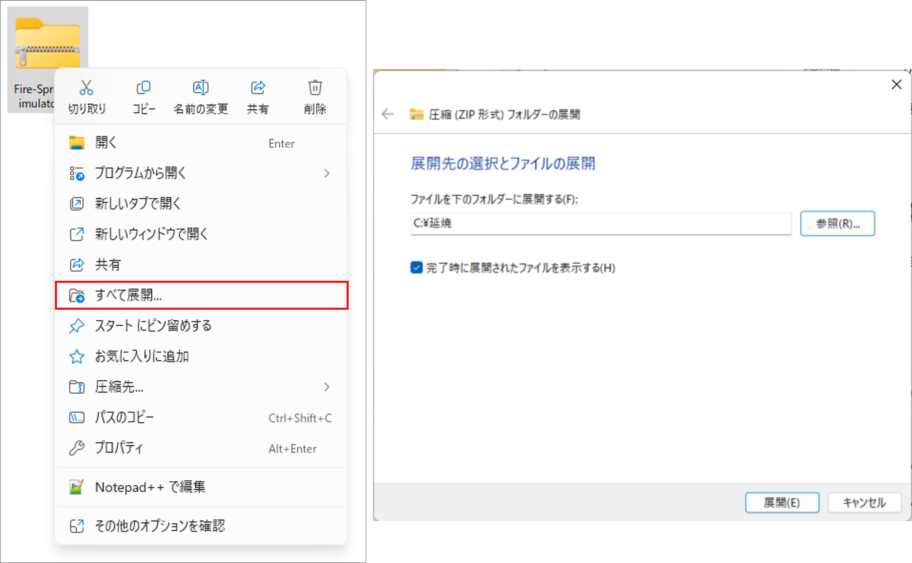
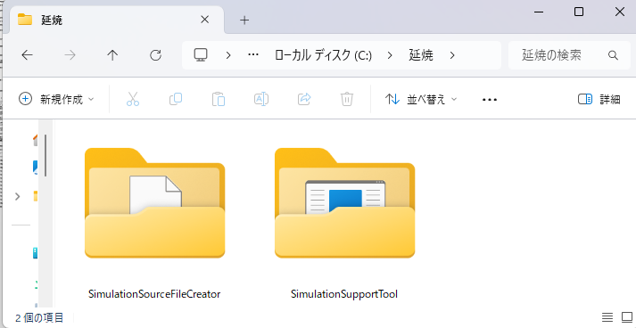
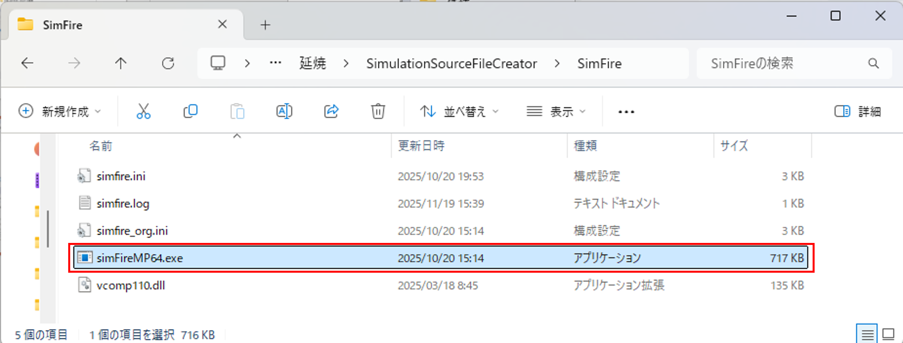
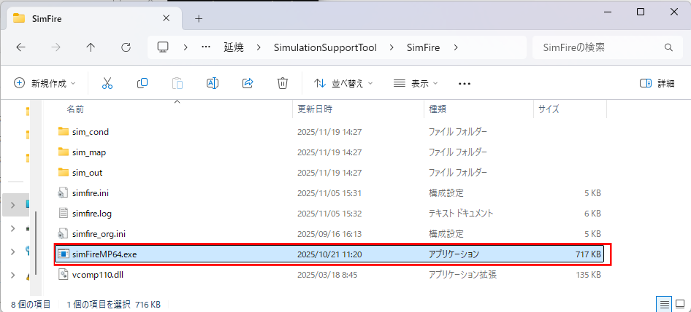

# 環境構築手順書

# 1 本書について

本書では、火災延焼シミュレーションシステム（以下「本システム」という。）の利用環境構築手順について記載しています。本システムの構成や仕様の詳細については以下も参考にしてください。

[技術検証レポート（URL要更新）](https://www.mlit.go.jp/plateau/file/libraries/doc/plateau_tech_doc_0030_ver01.pdf)

※本システムを実行するには「市街地火災シミュレーションプログラム」のエンジンが必要です。エンジンは、現時点では開発中のため一般公開されていません。詳細は、[GitHub火災延焼シミュレーションシステムページ](https://github.com/Project-PLATEAU/Fire-Spread-Simulator)の「3. 利用手順」をご確認ください。

# 2 動作環境

本システムの動作環境は以下のとおりです。

| 項目               | 推奨動作環境                                                                                                                                                                                                                                                                                                                                    |                    | 
| ------------------ | ----------------------------------------------------------------------------------------------------------------------------------------------------------------------------------------------------------------------------------------------------------------------------------------------------------------------------------------------- | ------------------------------ | 
| OS                 | Microsoft Windows 11                                                                                                                                                                                                                                                                                                                  | 
| CPU                | Intel Core i5以上                                                                                                                                                                                                                                                                                                                                             | 
| メモリ             | 8GB以上                                                                                                                                                                                                                                                                                                                                                        | 
| ディスプレイ解像度 | 1920×1080                                                                                                                                                                                                                                                                                                                                                 | 
| ネットワーク       | 背景地図表示のため以下のURLを閲覧できる環境が必要 ・地理院タイル 　標準地図：https://cyberjapandata.gsi.go.jp/xyz/std/{z}/{x}/{y}.png 　淡色地図：https://cyberjapandata.gsi.go.jp/xyz/pale/{z}/{x}/{y}.png 　写　　真：https://cyberjapandata.gsi.go.jp/xyz/seamlessphoto/{z}/{x}/{y}.jpg| 

# 3 インストール手順

## 3.1ダウンロード・展開

[こちら](https://github.com/Project-PLATEAU/Fire-Spread-Simulator/releases/)
からアプリケーションをダウンロードします。

ダウンロード後、zipファイルを右クリックし、「すべて展開」を選択し、任意のフォルダにzipファイルを展開します。

※ここでは、「C:\延焼」に展開しています。

展開が完了すると「C:\延焼」の配下に「SimulationSourceFileCreator」フォルダ（ファイル作成ツールのフォルダ）と「SimulationSupportTool」（条件設定支援ツールのフォルダ）が作成されます。

## 3.2エンジン格納

国総研より配布を受けたエンジン「simFireMP64.exe」を以下の2か所に配置します。

「C:\延焼\SimulationSourceFileCreator\SimFire」

「C:\延焼\SimulationSupportTool\SimFire」

※「C:\延焼」以外のフォルダに展開した場合、適宜、読み替えて下さい。

以下、操作マニュアル(ファイル作成ツール)の手順で本システムを実行できます。