# 操作マニュアル（ファイル作成ツール）

# 1.	はじめに
## 1.1	本書について
本書は、「ファイル作成ツール」の操作マニュアルです。このツールを使うことで、、国土技術政策総合研究所及び国立研究開発法人建築研究所が共同で開発した「国総研市街地延焼シミュレーションプログラム」で使用する入力ファイルを作成することができます。
本書では、ファイル作成ツールの起動から入力ファイルの作成まで、一連の操作手順を解説します。 火災延焼シミュレーションの準備を初めて行う方を対象に、本書の手順通りに操作することで、ファイル作成ツールに必要なファイルを作成できる構成になっています。

## 1.2.	このツールでできること
国総研市街地延焼シミュレーションプログラムを実行するには、建物の形状や構造など、詳細情報を含む専用の入力ファイルが必要です。本ツールは、3D都市モデル(Project PLATEAU)からそれらの情報を取得し  、シミュレーションが読み込める形式に変換・出力します。本ツールをご利用いただくことで、ユーザーは複雑なファイルフォーマットを意識することなく、シミュレーション用の入力ファイルを作成できます。

## 1.3.	ツール利用の流れ
本シミュレーションシステムには、本書で説明する「ファイル作成ツール」の他に、「条件設定支援ツール」というもう一つのツールがあります。 
これら2つのツールを順番に利用することで国総研市街地延焼シミュレーションプログラムを容易実行できます。作業のおおまかな手順は以下の通りです。

**【STEP 1】 ファイル作成ツール（本ツール）で、シミュレーション用の入力ファイルを作成する**

 - はじめに、本書で解説する「ファイル作成ツール」を使います。
 - 本ツールは、**3D都市モデル(Project PLATEAU)から建物の形状や構造データを取得**し、シミュレーションの入力ファイルを作成します。

**【STEP 2】 条件設定支援ツールで、シミュレーションを実行する**
- 次に、「条件設定支援ツール」を使い、STEP 1で作成したデータファイルを読み込みます。
- GUI（地図画面）上で**出火点や風速・風向、時間といった条件を設定**し、シミュレーションプログラム本体（エンジン）を呼び出して、解析を実行します。

本書では、上記【STEP 1】の操作について詳しく解説します。 ※「条件設定支援ツール」の操作方法については、別途専用のマニュアルをご参照ください。

# 2.	準備と起動

## 2.1.	3D都市モデルのダウンロード
本ツールで利用する3D都市モデルのデータを準備します。データは主に「G空間情報センター」のWebサイトから入手できます。手順は以下の通りです。

**1. Webサイトにアクセスする**

以下のサイトにアクセスし、3D都市モデルのデータをダウンロードします。

[G空間情報センター](https://front.geospatial.jp/plateau_portal_site/)

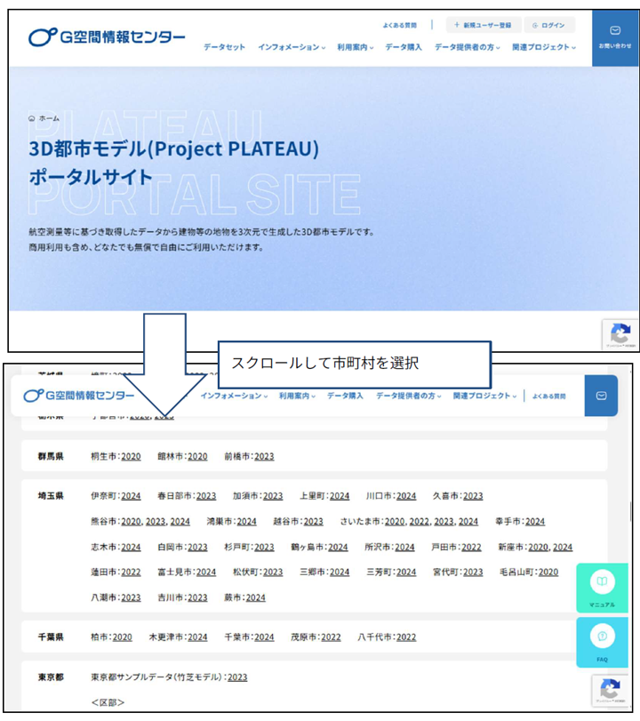

※上記画面は2025年9月時点のものです。

**2. データをダウンロードする**

サイトの案内に従い、シミュレーション対象としたい市町村のデータを検索し、PCにダウンロードします。 
【重要】本ツールで利用できるデータ形式は 「CityGML」 です。ダウンロードする際は、必ずファイル形式が「CityGML」であることを確認してください。

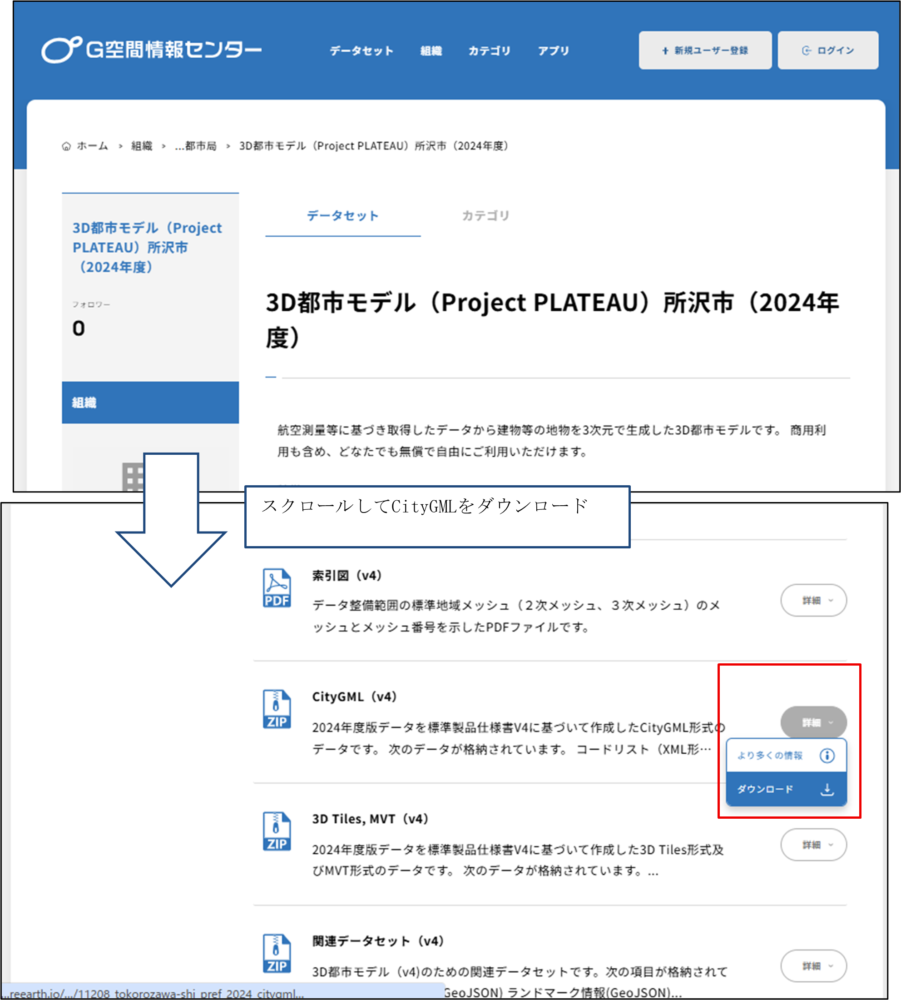

**3. zipファイルを解凍し、任意のフォルダに配置する**

ダウンロードしたファイルはzip形式で圧縮されています。このzipファイルを解凍（展開）し、中身のファイル群を任意のフォルダに配置   してください。

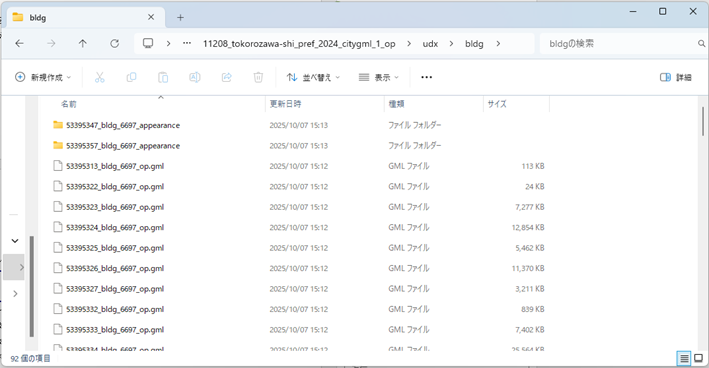

※本書では例として、展開先を「C:\延焼\3D都市モデル」フォルダとします。ご使用中の環境に合わせて、適宜読み替えてください。
※「C:\延焼\3D都市モデル」フォルダに所沢市の3D都市モデルを展開した場合、建物データは「C:\延焼\3D都市モデル\11208_tokorozawa-shi_pref_2024_citygml_1_op\udx\bldg」に格納されます（2025年10月現在）。

## 2.2.	起動方法 ##

「SimulationSourceFileCreator」フォルダ内の「SimulationSourceFileCreator.exe」ファイルをダブルクリックして「ファイル作成ツール」を起動します。

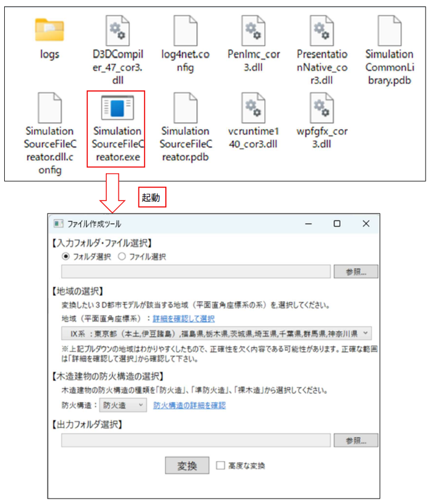

## 2.3.	画面の基本的な見方と操作 ##

ツールを起動すると、以下のメイン画面が表示されます。ここでは、各部の基本的な役割を説明します。

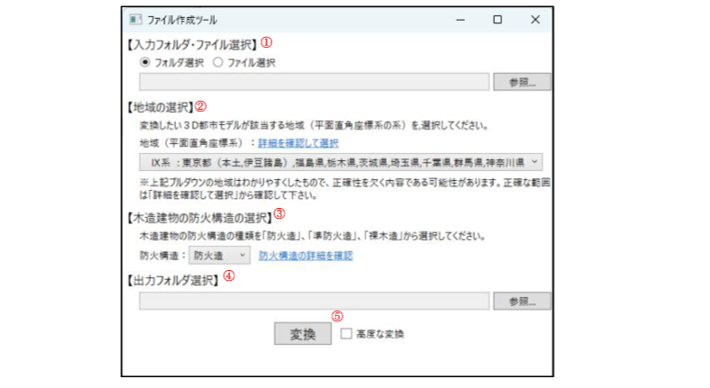

**①入力フォルダ・ファイル選択**

変換元となる3D都市モデルのデータを選択します。データが格納されているフォルダ、またはその中にある特定のCityGMLファイルを直接選択することができます。

**② 地域の選択**

利用するデータの平面直角座標系の系番号を選択します。地域の系番号がご不明な場合は、「詳細を確認して選択」  リンクをご参照ください。

**③ 木造建物の防火構造の選択**

3D都市モデルには木造建物の防火構造に関する情報が含まれていないため、対象の木造建物に一律で適用する防火性能を選択します。選択肢は「防火造」「準防火造」「裸木造」の3種類です。各性能の詳細がご不明な場合は、「防火構造の詳細を確認」  リンクをご参照ください。

**④ 出力フォルダの選択**

変換後のシミュレーション用入力ファイルを保存する先のフォルダを選択します。

**⑤ 変換**

入力データとここまでの設定内容に基づき、シミュレーション用入力ファイルへの変換処理を実行します。処理が完了すると、④で指定した出力先フォルダにファイルが作成されます。

# 3.	使い方（入力ファイル作成の手順）

## 3.1.	入力データを選択する
変換元となる3D都市モデルのデータを選択します。
1.	ラジオボタンで、「フォルダ選択」または「ファイル選択」のどちらかを選びます。
2.	右側にある[参照...]ボタンをクリックします。
3.	ダイアログボックスが表示されたら、第2章で準備した3D都市モデルのフォルダ（またはCityGMLファイル）を選択し、[OK]ボタンをクリックします。
4.	選択したデータの場所（パス）がテキストボックスに表示されたことを確認します。

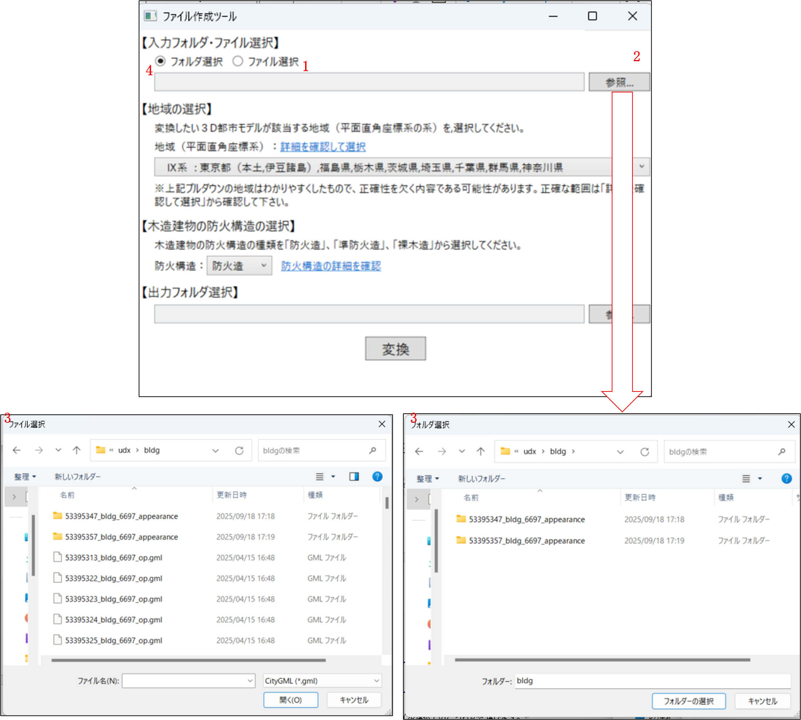

※「C:\延焼\3D都市モデル」フォルダに所沢市の3D都市モデルを展開した場合、建物データは「C:\延焼\3D都市モデル\11208_tokorozawa-shi_pref_2024_citygml_1_op\udx\bldg」に格納されています。

## 3.2.	地域を選択する
変換したい3D都市モデルが該当する地域（平面直角座標系の系）を選択します。
1.	【地域の選択】にあるプルダウンメニューをクリックします。
2.	対象の地域が含まれる系（例：「IX系：東京都...」など）を選択します。
3.	地域の系番号が不明な場合は、「詳細を確認して選択」のリンクをクリックして、正しい系をご確認ください。

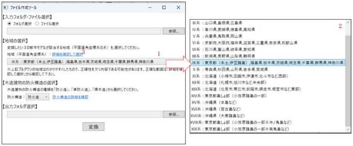

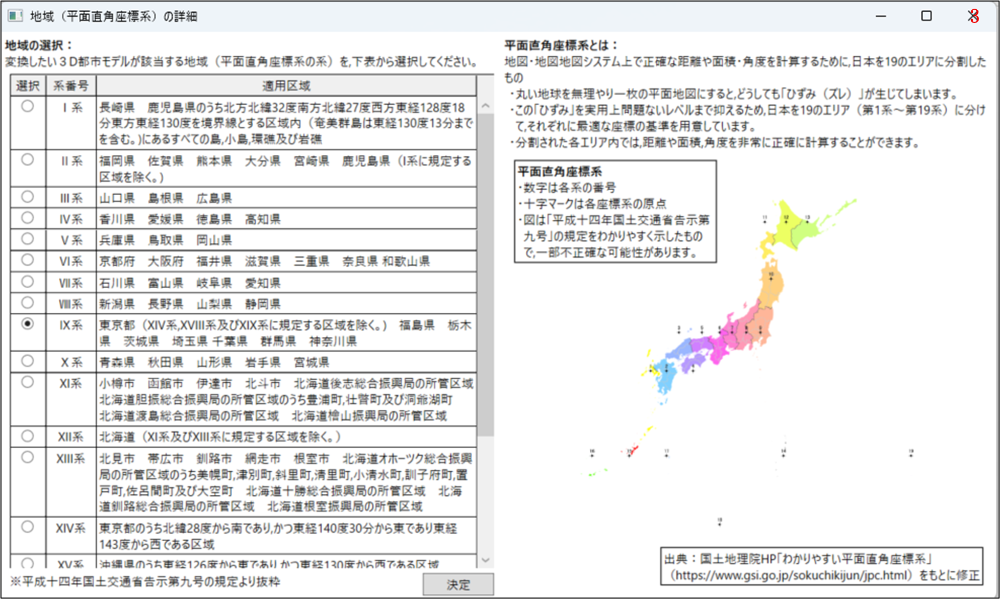

**【補足】平面直角座標系とその地域区分** 
**平面直角座標系とは：**

- 地図・地図  システム上で正確な距離や面積・角度を計算するために、日本を19のエリアに分割したもの。
- 丸い地球を無理やり一枚の平面地図にすると、どうしても「ひずみ（ズレ）」が生じてしまいます。
- この「ひずみ」を実用上問題ないレベルまで抑えるため、日本を19のエリア（第1系〜第19系）に分けて、それぞれに最適な座標の基準を用意しています。
- 分割された各エリア内では、距離や面積、角度を非常に正確に計算することができます  。
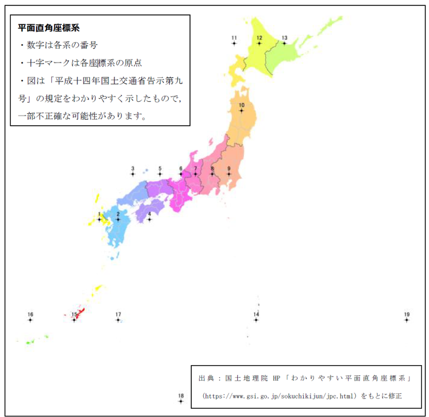

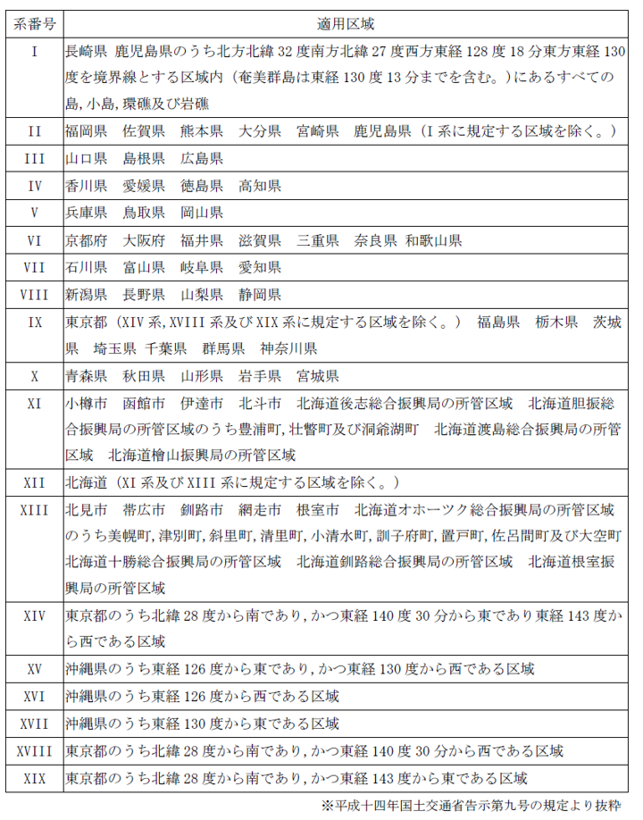

## 3.3.	木造建物の防火構造を選択する
3D都市モデルに含まれる木造建物に、一律で適用する防火構造を選択します。
1.	「防火構造」のプルダウンメニューをクリックします。
2.	「防火造」「準防火造」「裸木造」の中から、適用したいものを1つ選択します。
3.	各選択肢の詳細が不明な場合は、「防火構造の詳細を確認」のリンクをご参照ください。

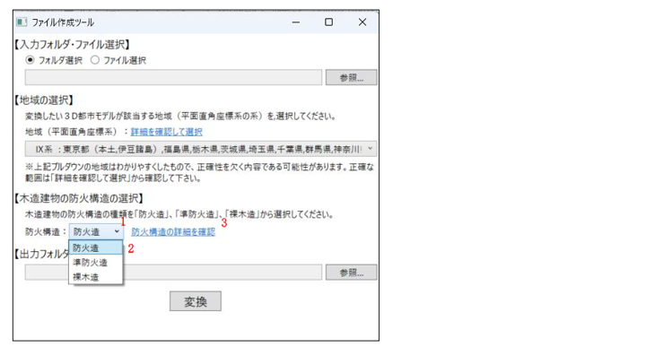

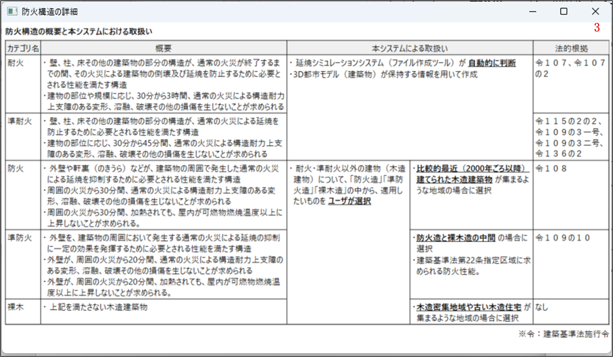

**【補足】防火構造の区分**
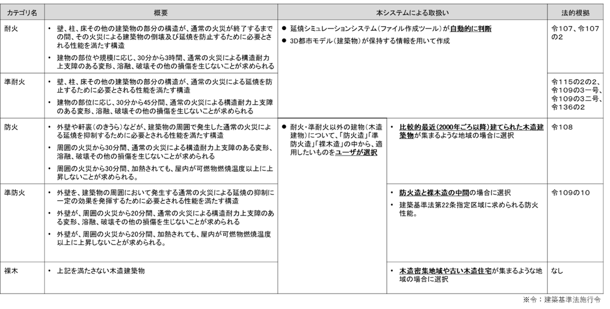

## 3.4.	出力フォルダを選択する
変換して作成される入力ファイルを、どこに保存するかを選択します。  
1.	【出力フォルダ選択】の右下にある[参照...]ボタンをクリックします。
2.	ダイアログボックスが表示されたら、ファイルの保存先としたいフォルダを選択し、[フォルダーの選択]ボタンをクリックします。
3.	選択したフォルダの場所（パス）がテキストボックスに表示されたことを確認します。

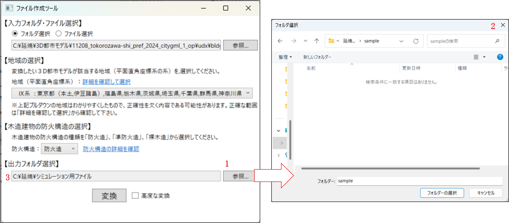

※ここでは、出力先フォルダとしては「C:\延焼\シミュレーション用ファイル」を指定しています。

## 3.5.	変換を実行する

すべての設定が完了したら、変換を実行します。
1.	画面下部にある[変換]ボタンをクリックします。
2.	処理が完了すると、3.4で指定した出力フォルダに、シミュレーション用の入力ファイルが作成されます。
3.	「変換が完了しました」のメッセージが表示されたら、[OK]ボタンをクリックしてダイアログを閉じます。

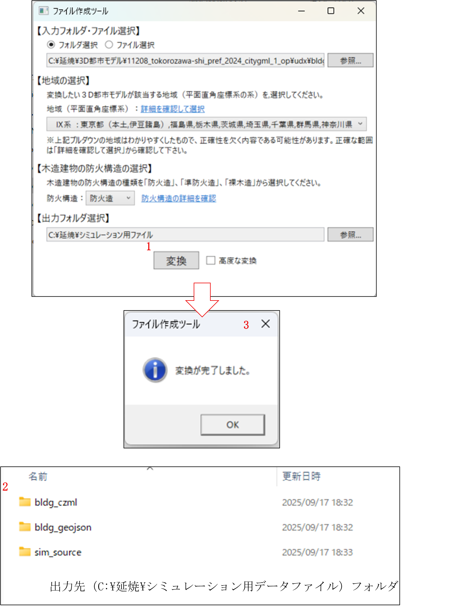

# 4.	その他

## 4.1.	高度な変換機能（建物ごとの防火構造設定）
「3.使い方（入力ファイル作成の手順）」の手順では、すべての木造建物に対して「一律の」防火属性（防火造・準防火造・裸木造）を設定しました。 本機能は、建物毎に個別の防火属性を設定したい場合に使用します。

**【注意】本機能の対象者について** 
本機能を利用するには、GIS（地理情報システム）データの確認スキルや、CSVファイルの仕様に関する知識が必要です。

**【Step1】中間CSVファイルの出力**
1.	「3.1 入力フォルダの選択」から「3.4 出力フォルダの選択」までの設定を、通常通り行います。
2.	画面にある 「高度な変換」チェックボックス にチェックを入れます。
3.	高度な変換用の設定項目が表示されます。
4.	【1.中間ファイル出力】の[出力] ボタンをクリックします。
5.	【2.中間ファイルの編集】の「テキストボックス」に記載されているフォルダに、防火属性設定用の中間CSVファイルが出力されます。

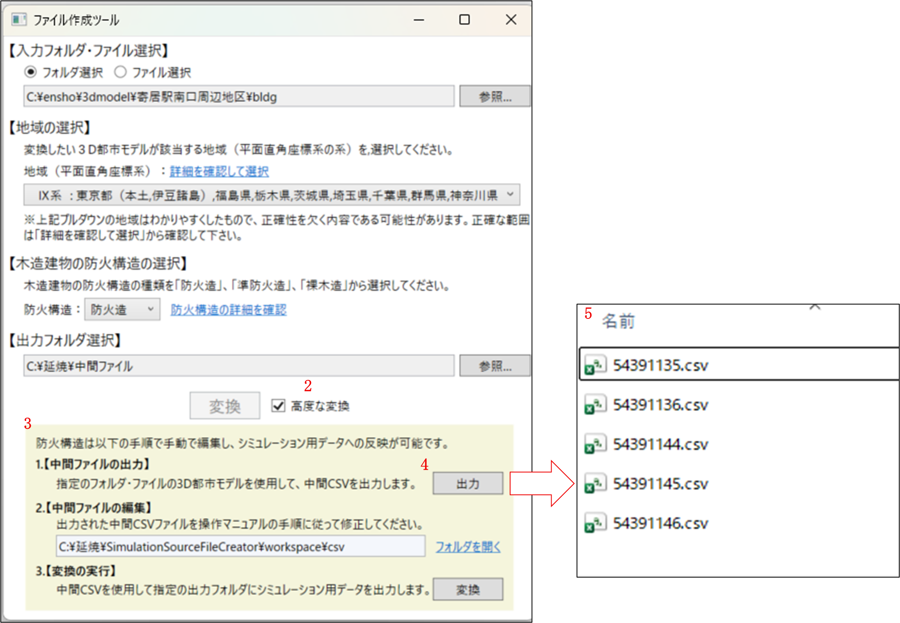

**【Step2】CSVファイルの編集**
1.	出力された中間CSVファイルを、テキストエディタや表計算ソフト（Excelなど）で開きます。
2.	建物ごとの属性データ等を直接編集し、ファイルを上書き保存します。

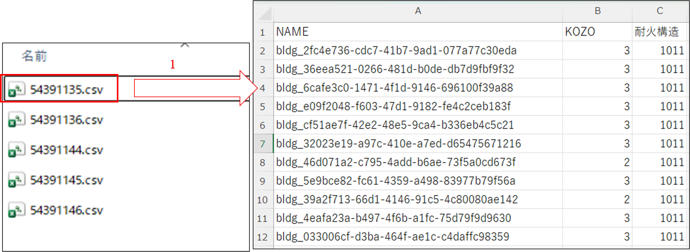

 **【参考】中間CSVファイルの仕様**
 
 NAME列（建物ID） 
・ 建物を識別するIDです。3D都市モデルのデータと紐付いています。

KOZO列（防火構造） 
・ この数値を書き換えることで、建物ごとに防火構造を指定できます。 
※1.耐火造　2.準耐火　3.防火造　4.準防火造　5.裸木造 
※以降の列は編集しないで下さい。 

 **【参考】編集したい建物のIDの特定方法** 
 編集したい建物がCSVファイル内のどのID（NAME）に該当するかは、QGIS等のGISソフトウェアで確認できます。 GISソフト上で地図とデータを照らし合わせ、IDを確認してから編集を行ってください。

 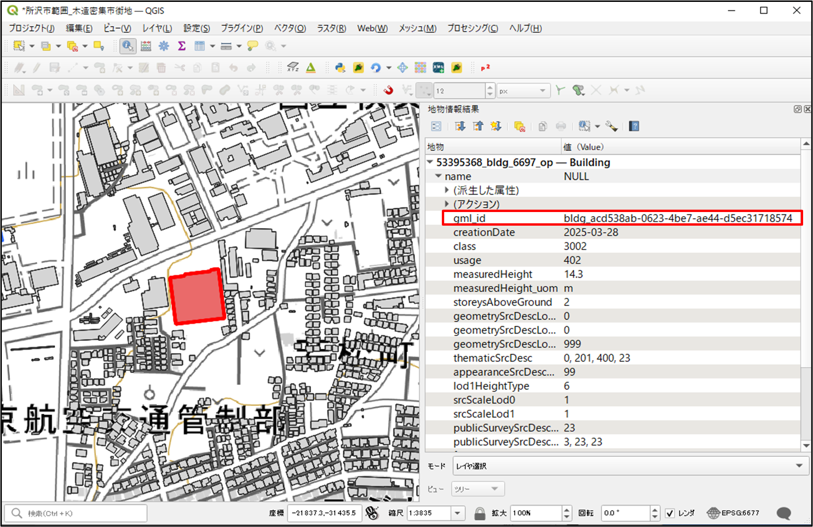

 **【Step3】変換の実行**
1.	ファイル作成ツールの画面に戻ります。
2.	【3.変換の実行】の[変換]ボタンをクリックします。
3.	「3.5変換を実行する」と同様に変換処理が行われます。

 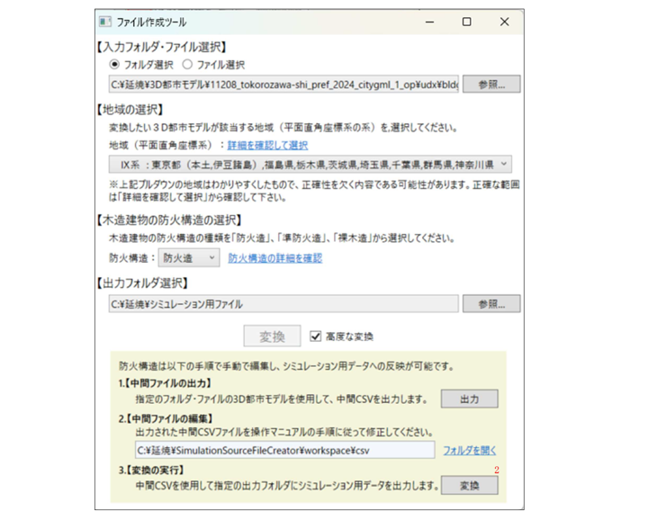

## 4.2.	ツールが正しく動作しない場合
ツール（exeファイル）をダブルクリックしても起動しない場合や、「変換」実行後、ファイルの作成が完了しない場合は、Windowsのセキュリティ機能によりブロックされている可能性があります。以下の対処法をご確認ください。

**【ケース1】Windows SmartScreenによるブロック**

以下のファイルをダブルクリックします。「WindowsによってPCが保護されました」という青い画面が表示されることがあります。
- SimulationSourceFileCreator\SimulationSourceFileCreator.exe
- SimulationSourceFileCreator\GeneFile\plateau_conv.exe
- SimulationSourceFileCreator\SimFire\simFireMP64.exe

1.	メッセージ内の 「詳細情報」 という文字をクリックします。
2.	画面下部に表示される 「実行」 ボタンをクリックしてください。

 

**【ケース2】ファイルのセキュリティ許可（ブロックの解除）**

以下のファイルのプロパティからセキュリティの許可を確認します。

- SimulationSourceFileCreator\SimulationSourceFileCreator.exe
- SimulationSourceFileCreator\GeneFile\plateau_conv.exe
- SimulationSourceFileCreator\SimFire\simFireMP64.exe

1.	上記ファイルを右クリックし、メニューからプロパティを選択します。
2.	「全般」タブの一番下にある「セキュリティ」欄を確認します。
3.	「許可する」というチェックボックスがある場合、チェックを入れて [OK] をクリックします。

 

