# 操作マニュアル（条件設定支援ツール）

# 1.	はじめに

## 1.1.	本書について
本書は、「条件設定支援ツール」の操作マニュアルです。このツールを使うことで、国土技術政策総合研究所が開発した「国総研市街地延焼シミュレーションプログラム」の実行に必要な出火点や風速・風向、時間といった条件を設定し、シミュレーションを実行することができます。
本書では、条件設定支援ツールで行う起動から各種条件の設定、シミュレーション実行までの一連の操作を解説します。それに加えて、シミュレーション後の結果ファイルの閲覧方法の例を紹介します。

## 1.2.	このツールでできること
本ツールは、「ファイル作成ツール」で作成した入力ファイルを読み込み、「国総研市街地延焼シミュレーションプログラム」の実行に必要な条件（出火点、風向・風速など）を設定するためのものです。
GUI（地図画面）上で建物を直接クリックして出火点を設定したり、ボタン操作で気象条件を設定したりと、視覚的な操作で簡単かつ正確に条件設定を行えるのが特長です。また、設定完了後、このツールから直接シミュレーションを実行できます。

## 1.3.	ツール利用の流れ
本シミュレーションシステムには、本書で説明する「条件設定支援ツール」の他に、「ファイル作成ツール」というもう一つのツールがあります。
これら2つのツールを順番に利用することで国総研市街地延焼シミュレーションプログラムを容易に実行できます。作業のおおまかな手順は以下の通りです。

**【STEP 1】 ファイル作成ツールで、シミュレーション用の入力ファイルを作成する**
-	はじめに、「ファイル作成ツール」を使います。
-	同ツールは、3D都市モデル(Project PLATEAU)から建物の形状や構造データを取得し、シミュレーションの入力ファイルを作成します。

**【STEP 2】 条件設定支援ツール（本ツール）で、シミュレーションを実行する**
-	次に、「条件設定支援ツール」を使い、STEP 1で作成したデータファイルを読み込みます。
-	GUI（地図画面）上で出火点や風速・風向、時間といった条件を設定し、シミュレーションプログラム本体（エンジン）を呼び出して、解析を実行します。

本書では、上記【STEP 2】の操作について詳しく解説します。 ※「ファイル作成ツール」の操作方法については、別途専用のマニュアルをご参照ください。

# 2.	準備と起動

## 2.1.	入力ファイルの用意

本ツールを利用するには、あらかじめ「ファイル作成ツール」で作成したシミュレーション用の入力ファイルが必要です。

**【重要】** 
もし、まだ入力ファイルを作成していない場合は、先に「ファイル作成ツール」の操作マニュアルを参照して、入力ファイルを作成してください。本ツールは、その作成済みファイルを読み込み、シミュレーション条件（出火点など）を設定するためのツールです。

なお、本書では「C:\延焼\シミュレーション用データ\」フォルダに「ファイル作成ツール」で作成したシミュレーション用の入力ファイルが格納されているものとして以降の説明を行います。

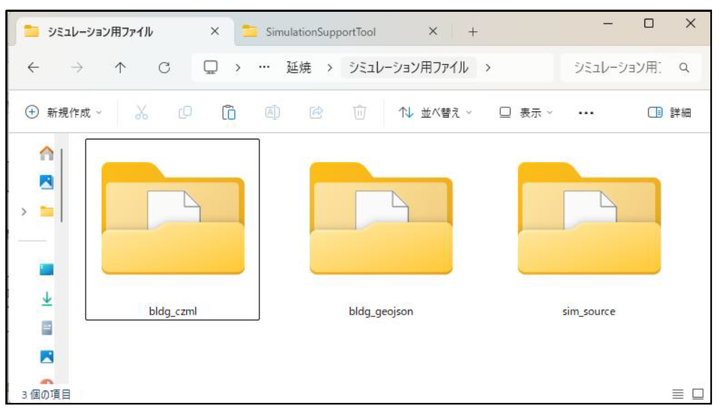

## 2.2.	起動方法
「SimulationSupportTool」フォルダ内の「SimulationSupportTool.exe」ファイルをダブルクリックして「条件設定支援ツール」を起動します。

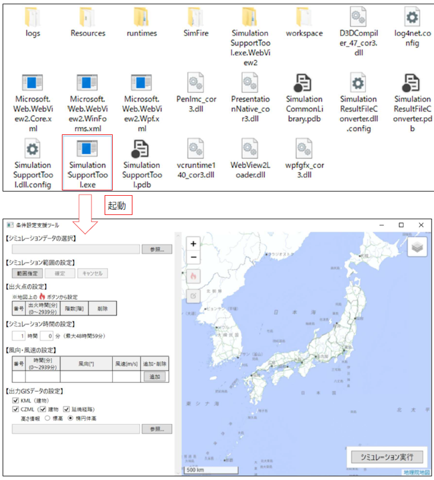

## 2.3.	画面の基本的な見方と操作
ツールを起動すると、以下のメイン画面が表示されます。ここでは、各部の基本的な役割を説明します。

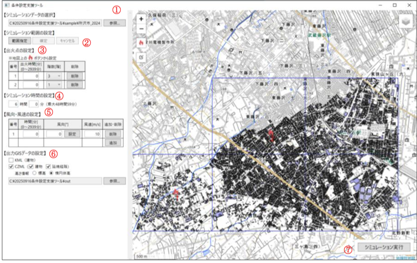

**①フォルダ選択**

「ファイル作成ツール」で作成した、シミュレーション用入力ファイルが格納されているフォルダを指定します。

**② シミュレーション範囲の指定**

地図上でシミュレーションを実行する範囲を、3次メッシュ単位で指定します。[範囲指定]ボタンでメッシュを表示させ、地図上で直接メッシュを選択することで範囲を定めます。

**③ 出火点の設定**

地図上の建物をクリックして出火点として設定し、その出火点の発生時刻や階数などの詳細条件を入力します。

**④ シミュレーション時間の設定**

延焼シミュレーションを何時間何分後まで計算するかを、時間と分の単位で設定します。（最大で48時間59分まで設定可能です。）

**⑤ 風向・風速の設定**

シミュレーションの時間経過にともなう、風向と風速の変化を設定します。、特定の時間（分）における風向（°）と風速（m/s）を複数設定することが可能です。[追加]ボタンで行を増やし、時間ごとに変化する風の状況を再現できます。

**⑥ 出力GISデータの設定**

出力するGISデータのファイル形式として、KMLまたはCZMLを選択します。CZMLを選択した場合には、データに含める内容（建物、延焼経路）や高さ**の基準もあわせて選択できます。

**⑦ シミュレーション実行**

①～⑥で設定したすべての内容に基づき、シミュレーションを実行するボタンです。

# 3.	使い方（シミュレーション結果データの作成まで）
## 3.1.	フォルダを選択する

シミュレーションの基礎データとなる入力ファイル群が格納されたフォルダを選択します。
1.	画面左上にある【シミュレーションデータの選択】エリアの[参照]ボタンをクリックします。
2.	フォルダを選択するための画面（ダイアログボックス）が表示されます。
3.	2.1で準備した入力ファイルが格納されているフォルダを選択し、[フォルダーの選択]ボタンをクリックします。
4.	選択したフォルダの場所（パス）が、[選択]ボタンの左側にあるテキストボックスに表示されたことを確認します。

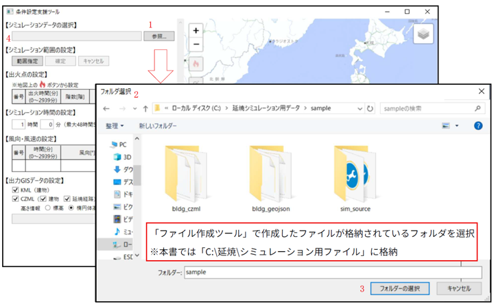

## 3.2.	シミュレーション範囲を選択する
地図上でシミュレーションを実行する範囲を選択します。

1.	画面の【シミュレーション範囲の指定エリアにある[範囲指定]ボタンをクリックします。
2.	地図画面上に、青い枠線の四角いマス（3次メッシュ）が表示されます。
3.	シミュレーションの対象としたいメッシュをクリックします。クリックしたメッシュは赤色に着色され、選択状態であることを示します。  
4.	範囲は複数選択することが可能です。選択済みのメッシュを再度クリックすると着色が解除され、非選択状態に戻ります。
5.	メッシュの選択が完了したら、確定ボタンをクリックします。地図上に選択したメッシュの建物データが表示されます。

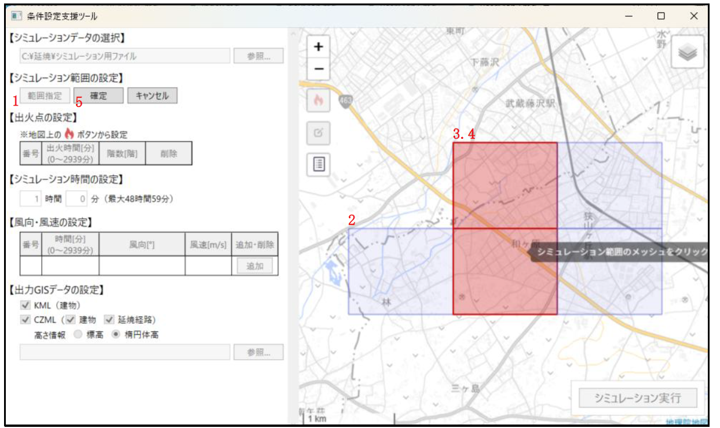

## 3.3.	出火点を設定する

シミュレーションの火元となる出火点を、地図上で設定します。出火点は複数設定することが可能です。
1.	まず、出火点を追加するモードに切り替えます。地図画面上にある[出火点]のアイコンをクリックしてください。
2.	地図画面上で、出火点に設定したい建物をクリックします。
3.	クリックした建物に　[出火点]のアイコンが表示され、画面左側の【出火点の設定】の表に新しい番号が追加されます。
4.	追加された行の「出火時間[分]」と「階数[階]」の欄を編集し、それぞれの値を設定します。
    - 出火時間：シミュレーション開始から何分後に出火するか
    - 階数：建物の何階から出火するか
5.	出火点の設定を間違えた、もしくは、削除したい場合は、対象の行の[削除]ボタンをクリックします。

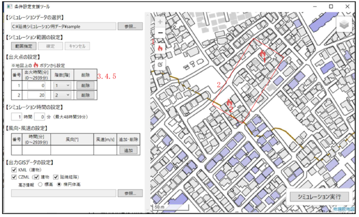

**•	建物の表示色・凡例**

　建物の表示色の凡例は地図画面上の凡例アイコンをクリックすることにより、表示されます。

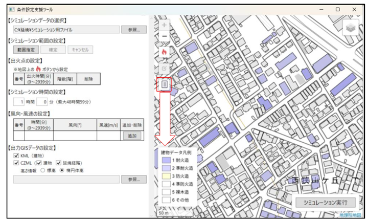

## 3.4.	シミュレーション時間を設定する

延焼シミュレーションを何時間後まで計算するかを設定します。

-	【シミュレーション時間の設定】エリアにある「時間」と「分」の入力ボックスに、それぞれ数値を入力してください。なお、設定できる時間は最大で48時間59分です。

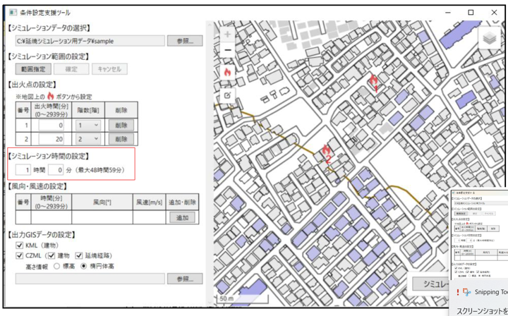

## 3.5.	風向・風速を設定する
シミュレーションの時間経過にともなう、風向と風速の変化を設定します。
1.	表の右側にある[追加]ボタンをクリックします。
2.	新しい行が追加されるので、「時間[分]」「風向[°]」「風速[m/s]」にそれぞれ数値を入力します。この操作を繰り返すことで、複数の時間における風況を設定できます。
3.	「風向[°]」列にある設定ボタンをクリックすることで、風向の設定ダイアログが起動します。ダイアログの矢印を押すことで風向を設定可能です。
4.	設定を削除したい場合は、対象の行の[削除]ボタンをクリックします。

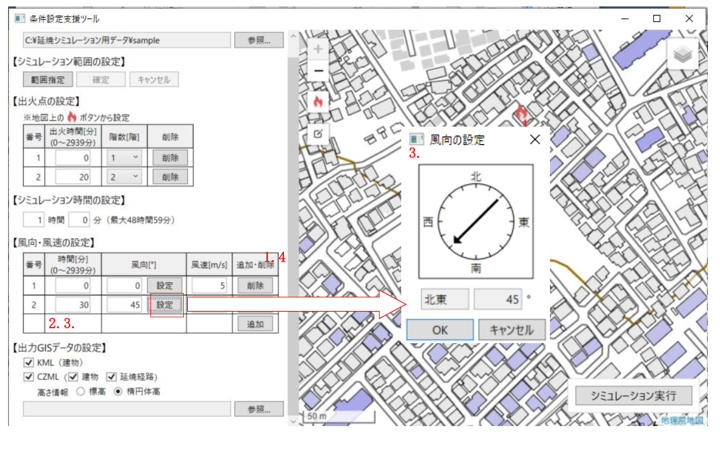

## 3.6.	出力GISデータの設定

シミュレーションの実行後に出力される、結果ファイルの形式や内容を設定します。
1.	出力したいファイル形式にチェックを入れます。「KML」と「CZML」の両方を選択することも可能です。
2.	「CZML」にチェックを入れた場合は、続けて以下の項目を選択します。  
    - 出力データ： ファイルに含めたいデータ（「建物」「延焼経路」）にチェックを入れます。（両方も選択可）
    - 高さ情報： 高さの基準を「標高」または「楕円体高」から選択します。

        ※CZMLは、Webブラウザ上で動作する3D地球儀「Cesium(セシウム)」で標準的に扱われるファイル形式です。一般的に「Cesium」では高さの基準として楕円体高を用いることが多いです。

3.	「参照」をクリックしてGISデータを出力するフォルダを選択します。

※本書では「C:\延焼\シミュレーション結果」を選択したものとして以降の説明を行います。

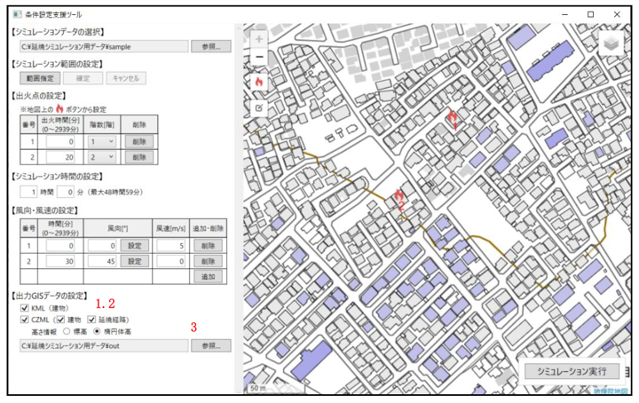

## 3.7.	シミュレーション実行

すべての設定が完了したら、シミュレーションを実行します。
1.	画面の右下にある [シミュレーション実行] ボタンをクリックします。
2.	確認のダイアログが表示されますので[OK]ボタンをクリックします。
3.	シミュレーションの計算が開始されます。処理には時間がかかる場合がありますので、完了するまでしばらくお待ちください。処理が完了すると、「シミュレーションが完了しました。」のメッセージが表示されます。
4.	「出力フォルダを開く」を押すと、KMLやCZMLなどの結果ファイルが出力されたフォルダが開きます。

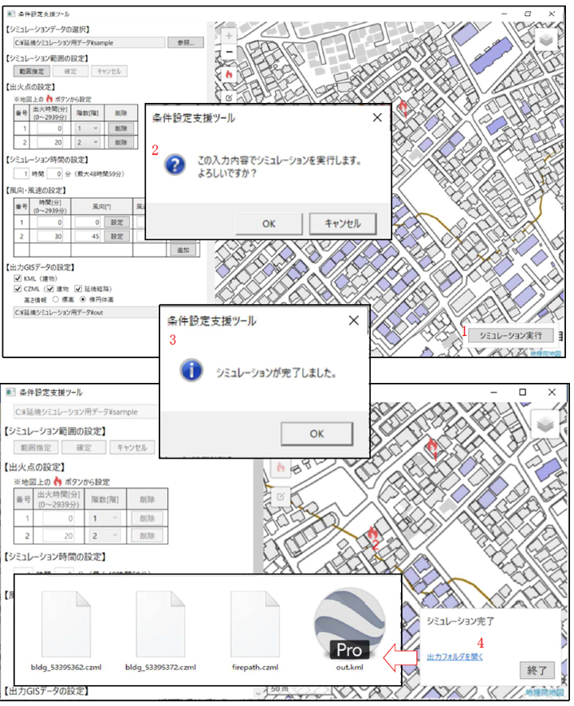

以上で、「条件設定支援ツール」を使ったシミュレーションの実行は完了です。

次の第4章で、ここで出力された結果ファイルの閲覧方法を紹介します。

# 4.	シミュレーション結果データの閲覧方法

 本章では、第3章で出力したCZML形式の結果ファイルの閲覧方法を紹介します。
CZML形式のファイルは、Webブラウザ上で3D地図を表示できるサービスで閲覧することが可能です。代表的なサービスには、国土交通省の「PLATEAU VIEW」や、オープンソースの3D地球儀ライブラリであるCesiumが提供する「Cesium Viewer」などがあります（2025年12月現在）。

> 【参考】：「Cesium Viewer」とは？ 
「Cesium Viewer」は、3D地図を扱うためのオープンソースライブラリ「CesiumJS」を開発しているチームが提供する、シンプルなWebアプリケーションです。 
専門的なソフトウェアをインストールすることなく、Webブラウザ上でCZMLなどの地理空間情報ファイルをドラッグ＆ドロップするだけで、簡単に3D地図上に表示・確認することができます。 
•	URL： https://cesium.com/cesiumjs/cesium-viewer/

この章では、この「Cesium Viewer」での閲覧方法を解説します。「PLATEAU VIEW」での閲覧方法については、以下の公式情報をご参照ください。

> 【参考】：「PLATEAU VIEW」での閲覧方法 
国土交通省が提供する「PLATEAU VIEW」でCZMLデータを閲覧する方法については、以下の公式チュートリアルをご参照ください。 
•	参照先： PLATEAU VIEWで体験する｜他の地理空間情報を重ねて確認＞1.コラム：任意の地理　空間情報を追加する 
•	URL： https://www.mlit.go.jp/plateau/learning/tpc02-2/

## 4.1.	Cesium Viewerにアクセスする

まず、Webブラウザを起動し、以下のURLにアクセスして「Cesium Viewer」を開きます。 
•	URL: https://cesium.com/cesiumjs/cesium-viewer/ 
画面に3Dの地球儀が表示されれば準備完了です。 

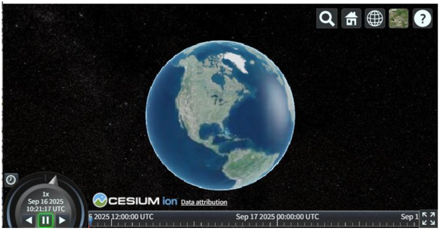

## 4.2.	CZMLファイルを読み込む

第3章で作成したCZML形式のファイルを「Cesium Viewer」に読み込ませます。
1.	エクスプローラーを開き、結果を保存したフォルダに移動します。
2.	対象のCZMLファイルを、WebブラウザのCesium Viewerの画面上へドラッグ＆ドロップします。※複数ファイル同時にドラッグ＆ドロップ可能ですが、動作が遅くなる場合があります。  

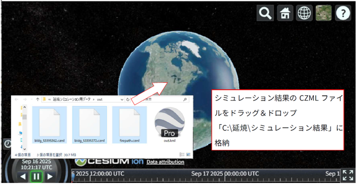

## 4.3.	シミュレーション結果を閲覧・操作する
ファイルが正常に読み込まれると、シミュレーション範囲の建物などが3D地図上に表示され、画面下部に時間操作用のタイムラインが表示されます。

 - **再生コントローラー**
    - [再生/一時停止ボタン]で、シミュレーションのアニメーションを開始・停止します。
    - タイムラインのスライダーをドラッグすることで、任意の時間における延焼状況を確認できます。

    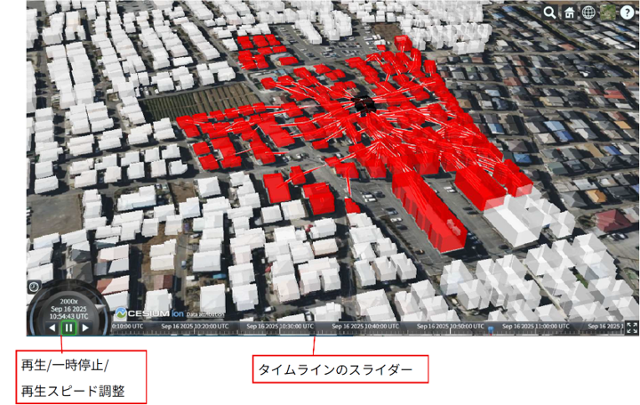

    
 - **視点（カメラ）の操作**
    - ズームイン/アウト: マウスホイールを回転させます。
    - 移動: マウスの左ボタンをドラッグしたまま動かします。
    - 回転/傾き: マウスの中ボタン（またはCtrlキー＋左ボタン）をドラッグしたまま動かします。
 
 - **建物の表示色**
    - 赤
： 出火中
    - 黒： 燃え尽き

        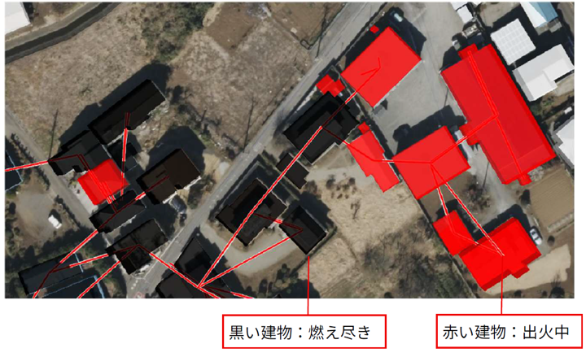

# 5.その他

 ## 5.1.	ツールが正しく動作しない場合
ツール（exeファイル）をダブルクリックしても起動しない場合や、シミュレーション実行後、シミュレーションが完了しない場合は、Windowsのセキュリティ機能によりブロックされている可能性があります。以下の対処法をご確認ください。

**【ケース1】Windows SmartScreenによるブロック**

以下のファイルをダブルクリックします。「WindowsによってPCが保護されました」という青い画面が表示されることがあります。
- SimulationSupportTool\SimulationSupportTool.exe
- SimulationSupportTool\ResultFileConv\SimulationResultFileConverter.exe
- SimulationSupportTool\SimFire\simFireMP64.exe 

1.	メッセージ内の 「詳細情報」 という文字をクリックします。
2.	画面下部に表示される 「実行」 ボタンをクリックしてください。

 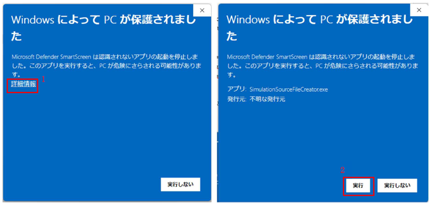

**【ケース2】ファイルのセキュリティ許可（ブロックの解除）**

以下のファイルのプロパティからセキュリティの許可を確認します。

- SimulationSupportTool\SimulationSupportTool.exe
- SimulationSupportTool\ResultFileConv\SimulationResultFileConverter.exe
- SimulationSupportTool\SimFire\simFireMP64.exe 

1.	上記ファイルを右クリックし、メニューからプロパティを選択します。
2.	「全般」タブの一番下にある「セキュリティ」欄を確認します。
3.	「許可する」というチェックボックスがある場合、チェックを入れて [OK] をクリックします。

 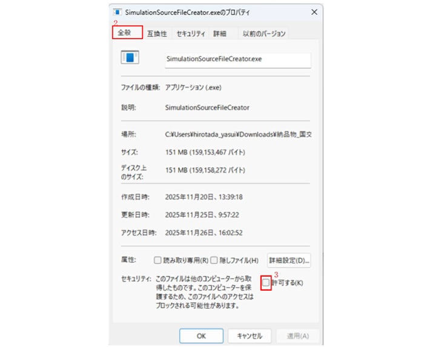

